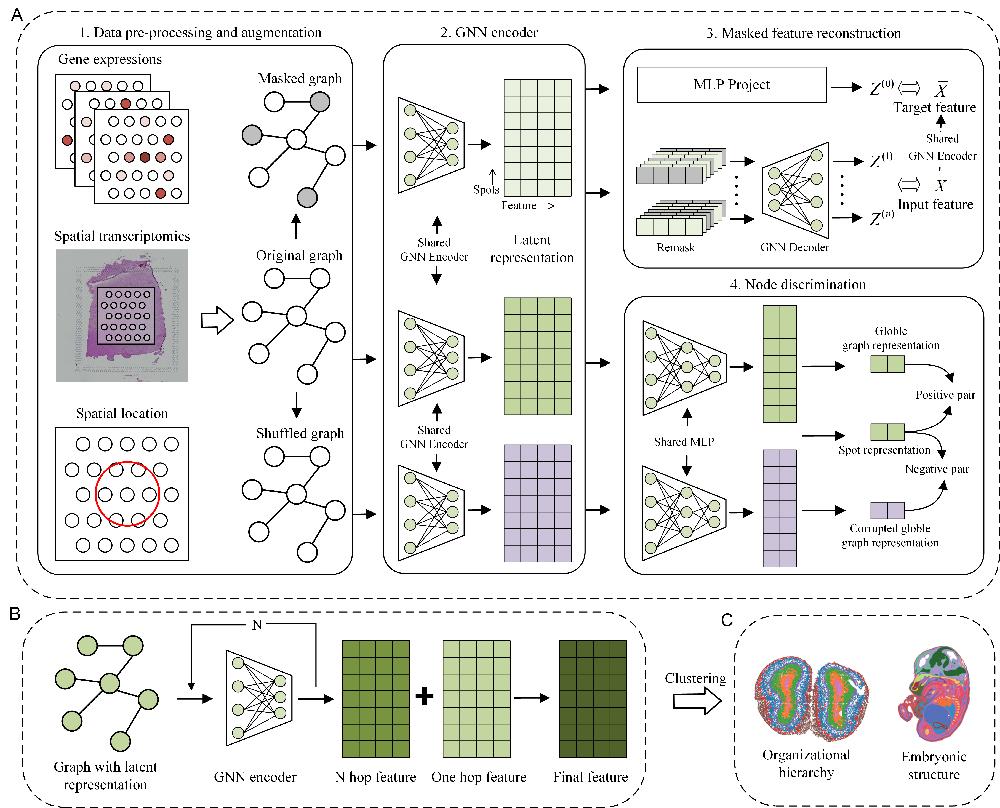

# MAEST
MAEST: Accurately Spatial Domain Detection in Spatial Transcriptomics with Graph Masked Autoencoder.

# Overview
Spatial transcriptomics (ST) technology provides gene expression profiles with spatial context, offering critical insights into cellular interactions and tissue architecture. A core task in ST is spatial domain identification, which involves detecting coherent regions with similar spatial expression patterns. However, existing methods often fail to fully exploit spatial information, leading to limited representational capacity and suboptimal clustering accuracy. 
Here, we introduce MAEST, a novel graph neural network model designed to address these limitations in spatial transcriptomics data. MAEST leverages graph masked autoencoders to denoise and refine representations while incorporating graph contrastive learning to prevent feature collapse and enhance model robustness. By integrating one-hop and multi-hop representations, MAEST effectively captures both local and global spatial relationships, improving clustering precision. 
Extensive experiments across diverse datasets, including the human brain, breast cancer, mouse hippocampus, olfactory bulb, brain, and embryo, demonstrate that MAEST outperforms seven state-of-the-art methods in spatial domain identification. Furthermore, MAEST showcases its ability to integrate multi-slice data, identifying joint domains across horizontal tissue sections with high accuracy. These results highlight MAEST’s versatility and effectiveness in unraveling the spatial organization of complex tissues.

# Software dependencies
